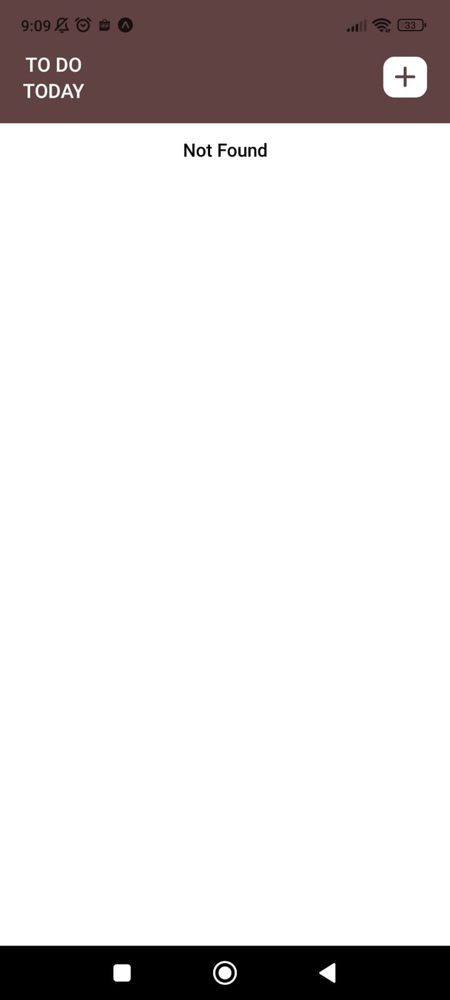
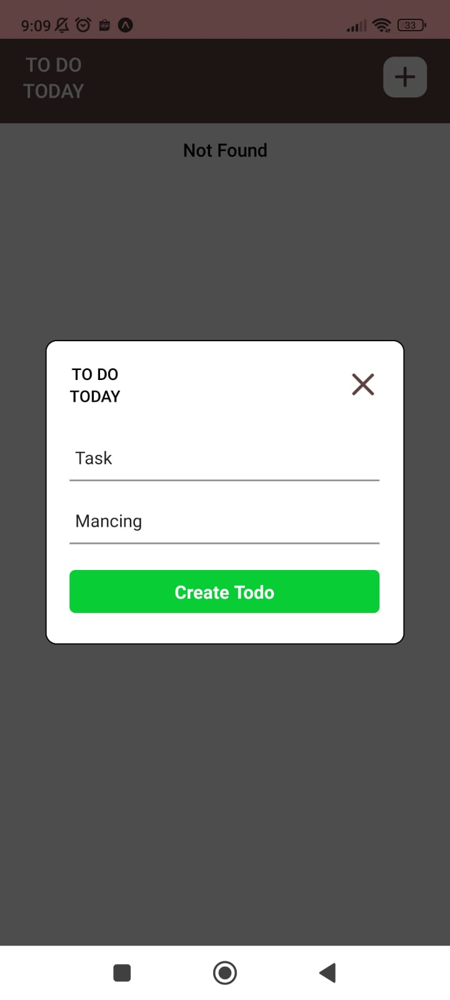
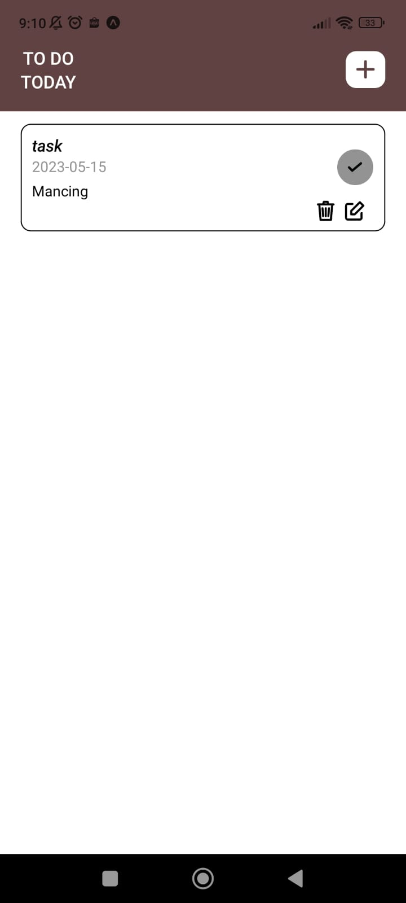
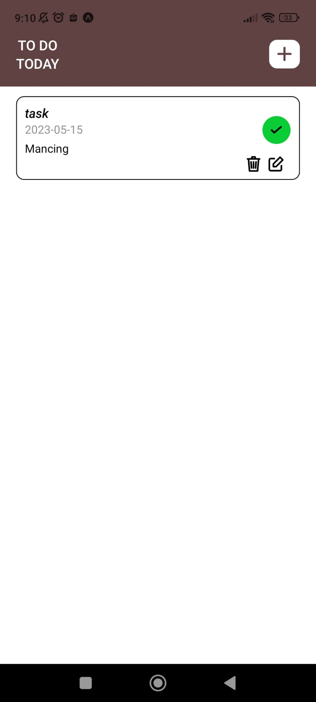
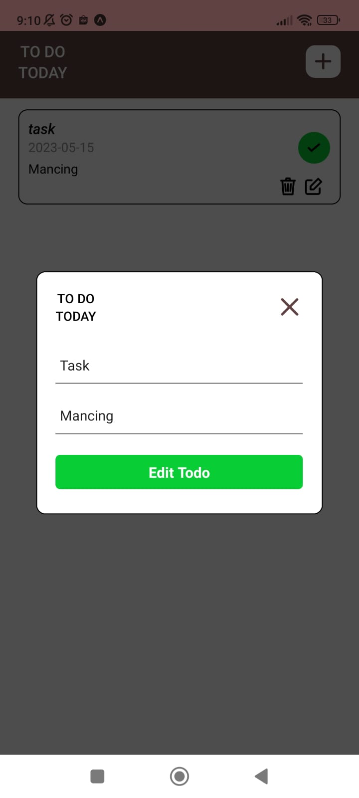

## Todo App with React Native
### This is assignment project Im built with React Native (Expo) using data from Express API [backend-ToDoApp](https://github.com/faisalchakiki/backend-ToDoApp).

### How to run this project
1. Clone this repo
2. Install Node Modules with `yarn install` / `npm install`
3. `npm run start`

### Preview App
| Home Menu  | Add Mode |
| ------------- | ------------- |
|   |  |

| After Add Mode | Checklist Mode | Edit Mode |
| ------------- | ------------- | ------------- |
|   |   |   |
